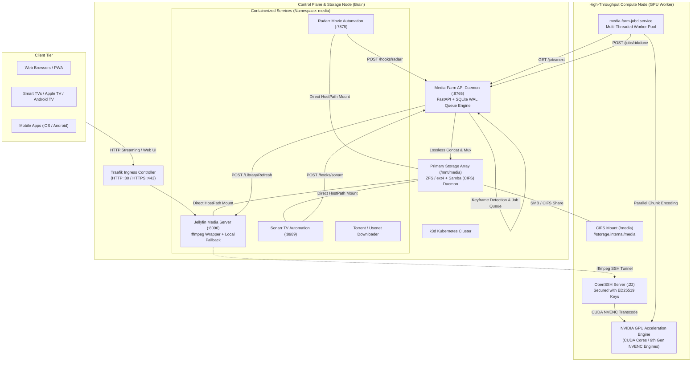

# Distributed Homelab & Autonomous Media Processing Cluster

[-326CE5?style=flat-square&logo=kubernetes&logoColor=white)](https://k3d.io/)
[](https://jellyfin.org/)
[](https://developer.nvidia.com/cuda-zone)
[](https://fastapi.tiangolo.com/)
[](https://www.python.org/)
[](https://ffmpeg.org/)
[](https://www.samba.org/)

A distributed, production-grade homelab architecture built on **Ubuntu Server**, declarative **Kubernetes (k3d)** container orchestration, and remote **NVIDIA GPU acceleration (WSL2 / Linux)**.

This infrastructure decouples 24/7 low-power containerized microservices and persistent network storage from high-throughput, compute-intensive hardware graphics tasks. The system features a custom distributed batch engine, **Media-Farm**, which leverages **Map-Reduce Parallel Media Chunking** to transcode 4K UHD and Remux master media into web-optimized companion files concurrently across multiple NVENC hardware engines, fully orchestrated via **Radarr** and **Sonarr** Webhooks with automated **Jellyfin** library synchronization.

---

## Table of Contents

- [1. Architectural Overview](#1-architectural-overview)
- [2. Component & Node Topology](#2-component--node-topology)
- [3. Real-Time Distributed Transcoding (rffmpeg)](#3-real-time-distributed-transcoding-rffmpeg)
  - [3.1 Execution Flow](#31-execution-flow)
  - [3.2 High-Availability & CPU/VAAPI Fallback](#32-high-availability--cpuvaapi-fallback)
- [4. Media-Farm: Map-Reduce Batch Engine](#4-media-farm-map-reduce-batch-engine)
  - [4.1 Map-Reduce Mechanics](#41-map-reduce-mechanics)
  - [4.2 Keyframe Discovery (O(1) Packet Inspection)](#42-keyframe-discovery-o1-packet-inspection)
  - [4.3 Multi-Threaded GPU Worker Daemon](#43-multi-threaded-gpu-worker-daemon)
  - [4.4 Master Stream-Copy & Lossless Remux](#44-master-stream-copy--lossless-remux)
- [5. Event-Driven Automation (Radarr & Sonarr Webhooks)](#5-event-driven-automation-radarr--sonarr-webhooks)
- [6. Storage Architecture & Path Virtualization](#6-storage-architecture--path-virtualization)
- [7. Security & Network Isolation](#7-security--network-isolation)
- [8. Repository Structure](#8-repository-structure)
- [9. Setup & Deployment Guide](#9-setup--deployment-guide)
  - [9.1 Prerequisites](#91-prerequisites)
  - [9.2 Control Plane (Brain Node) Deployment](#92-control-plane-brain-node-deployment)
  - [9.3 GPU Worker Deployment](#93-gpu-worker-deployment)
  - [9.4 Webhook Ingestion Configuration](#94-webhook-ingestion-configuration)
- [10. Testing & Verification](#10-testing--verification)
- [11. Engineering Roadmap](#11-engineering-roadmap)

---

## 1. Architectural Overview

The homelab is structured around two dedicated compute tiers interconnected over a local gigabit/multi-gigabit network:

1. **Central Control Plane & Storage Node (Brain)**:
   - Runs on a dedicated, low-power Ubuntu Linux server.
   - Hosts the persistent storage pool (ZFS/ext4) and exposes it via local mounts and authenticated Samba/CIFS shares.
   - Runs a lightweight declarative Kubernetes cluster (`k3d`) hosting containerized media services, automated download managers, and reverse proxy ingress.
   - Hosts the **Media-Farm API**, an asynchronous FastAPI orchestrator managing SQLite-backed distributed job queues and webhook receptors.

2. **Distributed GPU Compute Node (Worker)**:
   - Runs on a dedicated workstation (Windows 11 with WSL2) equipped with an NVIDIA GPU (GeForce RTX series with 9th-generation NVENC/NVDEC and pure CUDA hardware pipelines).
   - Mounts the central storage volume over CIFS using high-throughput, low-latency caching parameters.
   - Executes real-time transcoding calls via `rffmpeg` SSH tunneling.
   - Runs a multi-threaded batch daemon (`media-farm-jobd.service`) that polls the Brain for chunk encoding jobs.



---

## 2. Component & Node Topology

| Component | Host / Runtime | Network Address | Function |
|:---|:---|:---|:---|
| **Jellyfin** | Kubernetes Pod | `jellyfin.media.svc.cluster.local:8096` | Streaming media server with hardware offloading hooks |
| **Media-Farm API** | Control Plane (Host) | `<brain-host>:8765` | Asynchronous job scheduler, Map-Reduce coordinator & webhook engine |
| **Radarr** | Kubernetes Pod | `radarr.media.svc.cluster.local:7878` | Movie collection monitor and download automation |
| **Sonarr** | Kubernetes Pod | `sonarr.media.svc.cluster.local:8989` | TV series monitor and download automation |
| **Traefik** | Kubernetes Ingress | `<brain-host>:80`, `:443` | Reverse proxy and SSL/TLS termination |
| **Samba (CIFS)** | Control Plane (Host) | `<brain-host>:445` | High-throughput networked storage export |
| **GPU Worker** | Workstation (WSL2) | `<gpu-worker-host>:22` | Dedicated CUDA & NVENC remote execution environment |
| **Media-Farm jobd** | Workstation (systemd) | Internal polling client | Multi-threaded worker consuming batch chunk jobs |

---

## 3. Real-Time Distributed Transcoding (rffmpeg)

### 3.1 Execution Flow

When a client device requests playback of an unsupported codec, resolution, or container, Jellyfin initiates on-demand transcoding:

1. Jellyfin calls `/usr/lib/jellyfin-ffmpeg/ffmpeg`, which is configured as a symlink to `rffmpeg`.
2. `rffmpeg` executes an automated health check probe against the remote GPU node via SSH.
3. The remote script verifies NVIDIA driver stability, NVENC accessibility, and CIFS mount responsiveness.
4. If healthy, the transcode parameters are tunneled via SSH and executed directly on the remote GPU using hardware NVDEC/NVENC.
5. Resulting HLS video segments are written to a shared transcode directory accessible instantly by both nodes without network copy overhead.

### 3.2 High-Availability & CPU/VAAPI Fallback

To prevent stream interruptions if the GPU workstation is powered down, rebooting, or under heavy gaming/render loads:

- The custom wrapper `ffmpeg-fallback-wrapper` monitors SSH connectivity with an aggressive 3-second timeout.
- If the GPU node does not respond or fails the preflight health check, the wrapper dynamically strips remote NVENC parameters and rewrites the command for local CPU execution (`libx264`/`libx265`) or integrated GPU hardware (`VAAPI`).
- The client stream initiates without failure, providing 100% playback reliability.

---

## 4. Media-Farm: Map-Reduce Batch Engine

4K UHD Blu-ray Remux files (60–90 GB, 80+ Mbps bitrates) cause significant bandwidth saturation and battery drain when streamed to mobile devices, laptops, or external networks. 

**Media-Farm** solves this by pre-computing high-efficiency companion versions (`[web].mkv`) using a distributed **Map-Reduce** paradigm:

```
                       [ 4K UHD / Remux Master File ]
                                      |
                           +----------v----------+
                           |    SPLIT / PREP     |  chunker.py: O(1) Keyframe discovery
                           | Packet Inspection   |  Calculates cut boundaries on IDR frames (<1s)
                           +----+-----+-----+----+
                                |     |     |
                    Chunk 0     |     |     | Chunk N
                   +------------+     |     +------------+
                   |                  |                  |
                   v                  v                  v
             +-----------+      +-----------+      +-----------+
             | MAP Job 0 |      | MAP Job 1 |      | MAP Job N |  jobd.py: Multi-Threaded Worker Pool
             | (Worker)  |      | (Worker)  |      | (Worker)  |  Parallel NVENC sessions on NVIDIA GPU
             +-----+-----+      +-----+-----+      +-----+-----+
                   |                  |                  |
                   +------------+     |     +------------+
                                |     |     |
                           +----v-----v-----v----+
                           |    REDUCE / MUX     |  reducer.py: Lossless stream-copy (-c copy)
                           | FFmpeg Concat Demux |  Preserves master audio (TrueHD/DTS) & PGS subs
                           +----------+----------+  Strict container & duration verification (<0.75s)
                                      |
                         [ Final Companion [web].mkv ]
```

### 4.1 Map-Reduce Mechanics

- **Split Stage (`chunker.py`)**: Analyzes the input container and partitions the continuous video timeline into discrete chunks aligned with keyframes.
- **Map Stage (`jobd.py`)**: Distributes individual chunk transcode jobs to available worker nodes. Each worker encodes only the video stream using hardware NVENC into intermediate MKV segments.
- **Reduce Stage (`reducer.py`)**: Gathers completed chunk segments, concatenates the video stream losslessly via FFmpeg's concat demuxer, and remuxes it with the original master container's audio, subtitle, and chapter tracks.

### 4.2 Keyframe Discovery (O(1) Packet Inspection)

Traditional video splitting decodes frames to find cut points, requiring minutes of heavy I/O for large files. Media-Farm uses packet-level demuxing:

```bash
ffprobe -v error -select_streams v:0 \
  -show_packets -show_entries packet=pts_time,flags \
  -of csv master_video.mkv
```

This reads container headers without decoding a single video frame, discovering all `K_` (Keyframe/IDR) timestamps in under 1 second on an 80 GB file. The chunker then selects the closest keyframe to the target segment duration (e.g., every 180 seconds), guaranteeing zero visual artifacts or dropped frames at concatenation boundaries.

### 4.3 Multi-Threaded GPU Worker Daemon

The worker runs `jobd.py` under systemd. Key capabilities include:

- **Configurable Concurrency**: Set via `MEDIA_FARM_CONCURRENCY=2`, allowing parallel chunk processing to maximize GPU hardware utilization.
- **Pure CUDA Filter Graph**: Video decoding, scaling, and pixel formatting are executed exclusively inside GPU VRAM, preventing CPU-GPU memory bus bottlenecks:
  ```bash
  ffmpeg -init_hw_device cuda=cu:0 -filter_hw_device cu \
    -hwaccel cuda -hwaccel_output_format cuda \
    -ss <start_time> -t <duration> -i input.mkv \
    -map 0:v:0 -an -sn -dn \
    -filter:v "scale_cuda=w=1920:h=-2:format=yuv420p" \
    -c:v hevc_nvenc -preset p4 -cq 23 \
    chunk_out.mkv
  ```
- **Active Lease Heartbeats**: Background threads maintain job ownership with the Brain API. If a worker node crashes or loses network connectivity, uncompleted jobs are automatically reclaimed and re-queued.

### 4.4 Master Stream-Copy & Lossless Remux

The Reduce phase ensures that high-fidelity multi-channel audio and subtitle formats are never degraded:

- **Video**: Stream-copied losslessly (`-c:v copy`) from the concatenated chunks.
- **Audio**: Extracted directly from the 4K master file (`-c:a copy`), retaining Dolby Atmos, TrueHD 7.1, DTS-HD MA, and multichannel AAC.
- **Subtitles**: Extracted without OCR rasterization (`-c:s copy`), maintaining PGS bitmap and ASS/SSA styling.
- **Validation**: Verifies total duration against the original master within a strict tolerance window (`<0.75s`) before committing the final file.

---

## 5. Event-Driven Automation (Radarr & Sonarr Webhooks)

Media-Farm operates autonomously within the home server ecosystem:

```mermaid
sequenceDiagram
    participant Arr as "Radarr / Sonarr"
    participant Brain as "Media-Farm Brain (:8765)"
    participant Worker as "GPU Worker Node"
    participant Storage as "Shared Storage (/media)"
    participant Jellyfin as "Jellyfin Server"

    Arr->>Brain: POST /hooks/radarr or /hooks/sonarr (On Import / Upgrade)
    Brain-->>Arr: 202 Accepted (Immediate response under 10ms)
    
    Note over Brain: Background task evaluates media resolution
    alt Media is 1080p or lower
        Note over Brain: Processing skipped; recorded in logs
    else Media is 4K / 2160p UHD
        Brain->>Brain: Acquire file concurrency lock
        Brain->>Storage: Inspect keyframes via ffprobe (under 1s)
        Brain->>Brain: Register parent job and chunk tasks in SQLite
        
        loop Worker Job Polling
            Worker->>Brain: GET /jobs/next?worker=worker-id
            Brain-->>Worker: 200 OK (Chunk assignment)
            Worker->>Storage: Read source video slice
            Worker->>Worker: Hardware NVENC encode on GPU
            Worker->>Storage: Write intermediate chunk.mkv
            Worker->>Brain: POST /jobs/:id/done
        end
        
        Brain->>Brain: Verify all chunks completed
        Brain->>Storage: Concat and remux with master audio/subtitles (reducer.py)
        Brain->>Storage: Write final web companion file
        Brain->>Jellyfin: POST /Library/Refresh (API Token Authenticated)
        Note over Jellyfin: Scans directory and binds companion version
    end
```

---

## 6. Storage Architecture & Path Virtualization

To eliminate file duplication and avoid transferring gigabytes of media over the API, all nodes reference a unified directory namespace:

```
Linux Host Path:       /mnt/media/Filmes/...
Container Mount:       /media/Filmes/...
WSL2 Worker Mount:     /media/Filmes/... (CIFS: //<storage-host>/media)
```

Path resolution is abstracted via `chunker.resolve_storage_path()`:
- Automatically maps between physical host paths (`/mnt/media`) and container/network paths (`/media`).
- All database state entries store canonical network paths (`/media/...`), ensuring jobs dispatched to remote workers execute seamlessly without path translation errors.

### CIFS Mount Parameters (WSL2 / Linux Worker)

The worker connects to the Samba share using high-throughput, low-latency streaming options in `/etc/fstab`:

```text
//<storage-host>/media /media cifs credentials=/etc/smbcredentials,uid=0,gid=0,iocharset=utf8,cache=loose,actimeo=30,rsize=1048576,wsize=1048576,async 0 0
```

- `cache=loose,actimeo=30`: Minimizes metadata round-trips over the network.
- `rsize=1048576,wsize=1048576`: Maximizes SMB packet payloads to 1 MB for gigabit throughput.

---

## 7. Security & Network Isolation

The infrastructure adheres to least-privilege and credential separation standards:

- **Network Segmentation**:
  - Kubernetes cluster pods operate on an isolated internal overlay network (`10.42.0.0/16`).
  - Ingress into services is strictly controlled via Traefik reverse proxy rules.
- **SSH Hardening**:
  - Inter-node communication for `rffmpeg` is secured with dedicated **ED25519** keypairs stored in Kubernetes Secrets.
  - Password authentication and root login via SSH are disabled on worker nodes.
- **API Authentication**:
  - The Media-Farm Brain API supports optional bearer token authentication (`MEDIA_FARM_TOKEN`).
  - Webhooks validate optional query parameter tokens (`?token=...`).

---

## 8. Repository Structure

```text
.
├── README.md                           Main repository documentation
├── README.internal.md                  Internal homelab documentation with specific network topology
├── README.github.md                    Public sanitized documentation for GitHub
├── PROJECT_HISTORY.md                  Chronological development history and phase completions
├── infra/
│   └── kubernetes/
│       ├── jellyfin/
│       │   ├── deployment.yaml         Jellyfin Kubernetes deployment with rffmpeg volume mounts
│       │   ├── service.yaml            ClusterIP service definition (:8096)
│       │   ├── ingress.yaml            Traefik Ingress route configuration
│       │   ├── storage.yaml            PersistentVolume and PersistentVolumeClaim manifests
│       │   ├── rffmpeg-config.yaml     ConfigMap containing rffmpeg.yml and known_hosts
│       │   ├── rffmpeg-secret.yaml     Kubernetes Secret with ED25519 private keys
│       │   ├── ffmpeg-fallback-wrapper Automated failover wrapper with local CPU/VAAPI fallback
│       │   ├── README.md               Comprehensive Jellyfin subsystem documentation
│       │   ├── media-farm/             Autonomous Map-Reduce batch transcoding subsystem
│       │   │   ├── api.py              Brain FastAPI service with job queues and webhook routes
│       │   │   ├── orchestrator.py     End-to-end pipeline runner with locks and duplicate guards
│       │   │   ├── chunker.py          Packet-level keyframe discovery and chunk planner
│       │   │   ├── reducer.py          Lossless FFmpeg concat and master container remuxer
│       │   │   ├── jobd.py             Multi-threaded worker daemon for NVIDIA GPUs
│       │   │   ├── install-brain.sh    Installation script for Control Plane systemd service
│       │   │   ├── install-worker.sh   Installation script for GPU Worker systemd service
│       │   │   ├── test-chunked-pipeline.py Interactive CLI runner with live ASCII progress bar
│       │   │   └── test_*.py           Automated test suite (17 unit and integration tests)
│       │   └── worker/
│       │       ├── setup-worker.sh     Idempotent provisioning script for WSL2/Linux workers
│       │       └── jellyfin-rffmpeg-health Remote worker health check executable
│       ├── radarr/                     Radarr automation Kubernetes manifests
│       ├── sonarr/                     Sonarr automation Kubernetes manifests
│       ├── transmission/               Transmission downloader Kubernetes manifests
│       └── media-organizer/            Post-download organizer manifests
└── scripts/                            Administrative, networking, and validation scripts
```

---

## 9. Setup & Deployment Guide

### 9.1 Stack

- **Control Plane**:
  - Ubuntu Server 22.04 LTS or newer.
  - Python 3.12+, `ffmpeg`, `ffprobe`.
  - Docker & `k3d` (or standard Kubernetes).
  - Samba daemon configured with read/write access to media storage.
- **GPU Worker**:
  - Windows 11 with WSL2 (Ubuntu).
  - NVIDIA GPU with up-to-date drivers supporting CUDA 12+ and NVENC.
  - OpenSSH Server installed and listening on port 22.
  - `cifs-utils` for mounting the shared storage.

### 9.2 Control Plane (Brain Node) Deployment

1. Navigate to the project directory on the control plane server and install dependencies:
   ```bash
   cd /srv/homelab
   sudo apt-get update && sudo apt-get install -y ffmpeg python3-fastapi python3-uvicorn
   ```
2. Provision the systemd daemon for the Brain API:
   ```bash
   sudo bash /srv/homelab/infra/kubernetes/jellyfin/media-farm/install-brain.sh
   sudo systemctl status media-farm-api.service
   ```
3. Deploy the Kubernetes manifests for media services:
   ```bash
   kubectl apply -k /srv/homelab/infra/kubernetes/jellyfin/
   ```

### 9.3 GPU Worker Deployment

1. On the worker machine, verify NVIDIA hardware encoding accessibility:
   ```bash
   nvidia-smi
   ffmpeg -encoders | grep nvenc
   ```
2. Configure `/etc/fstab` with your CIFS credentials and mount points:
   ```bash
   sudo mkdir -p /media /media/cache/jellyfin-transcodes
   sudo mount -a
   ```
3. Provision and launch the worker daemon:
   ```bash
   export MEDIA_FARM_BRAIN="http://<brain-host>:8765"
   export MEDIA_FARM_WORKER="gpu-worker-01"
   export MEDIA_FARM_CONCURRENCY=2
   sudo -E bash /path/to/media-farm/install-worker.sh
   sudo systemctl status media-farm-jobd.service
   ```

### 9.4 Webhook Ingestion Configuration

Configure **Radarr** and **Sonarr** to notify Media-Farm whenever media is imported or upgraded:

1. Open the web interface for Radarr or Sonarr.
2. Go to **Settings** > **Connect** > **Add Connection (+)** > **Webhook**.
3. Set the following parameters:
   - **Name**: `Media-Farm 4K Transcode`
   - **Notification Triggers**: Select **Only** `On File Import` and `On Upgrade`. Disable all others.
   - **URL**:
     - Radarr: `http://<brain-host>:8765/hooks/radarr`
     - Sonarr: `http://<brain-host>:8765/hooks/sonarr`
   - **Method**: `POST`
4. Click **Test** to verify connectivity (the API will return `202 Accepted`).
5. Click **Save**.

---

## 10. Testing & Verification

The repository includes a comprehensive unit and integration test suite:

```bash
python3 -m unittest discover -s infra/kubernetes/jellyfin/media-farm -p "test_*.py"
```

Expected output:
```text
................
----------------------------------------------------------------------
Ran 17 tests in 0.124s

OK
```

To run an interactive end-to-end benchmark on an actual media file with a visual progress bar:

```bash
python3 infra/kubernetes/jellyfin/media-farm/test-chunked-pipeline.py \
  /media/Movies/Example_Movie.mkv \
  180 \
  http://<brain-host>:8765
```

---

## 11. Engineering Roadmap

- [x] Declarative container orchestration with Kubernetes (`k3d`).
- [x] Remote hardware-accelerated on-demand transcoding (`rffmpeg`) via SSH.
- [x] Proactive health checks and transparent local CPU/VAAPI failover wrapper.
- [x] Distributed Map-Reduce media chunking batch engine (`media-farm`).
- [x] O(1) packet-level keyframe boundary discovery.
- [x] Automated webhook ingestion pipelines for Radarr and Sonarr.
- [x] Automated post-transcode Jellyfin library refresh.
- [ ] Hardware-accelerated HDR10 / Dolby Vision to SDR Tone Mapping (CUDA BT.2390) for companion files.
- [ ] Automated cleanup and orphan companion file purging upon media deletion or upgrade.
- [ ] Lightweight web-based real-time telemetry and management dashboard (`/dashboard`).
- [ ] AV1 NVENC profile support for higher compression density.
- [ ] Centralized metrics export to Prometheus and Grafana dashboards.
