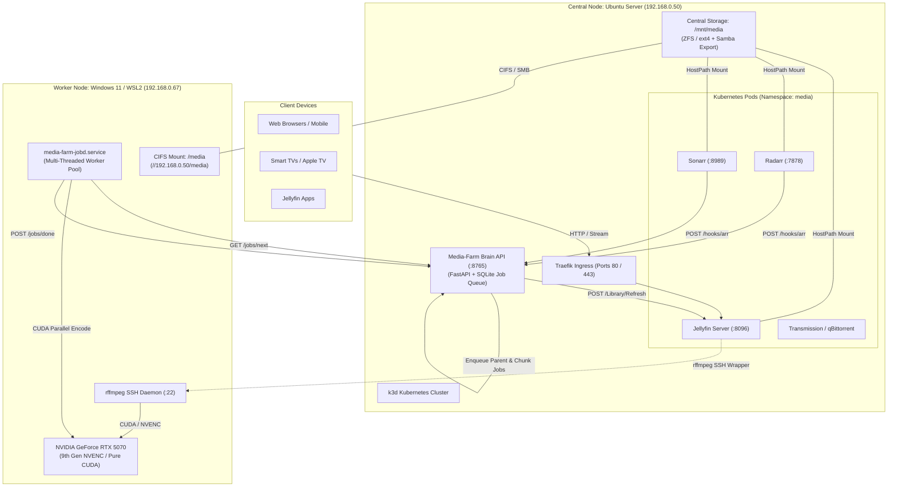

# Home-Server & Media-Farm Cluster

[](https://k3d.io/)
[](https://jellyfin.org/)
[-76B900?style=flat-square&logo=nvidia&logoColor=white)](https://developer.nvidia.com/cuda-zone)
[](https://fastapi.tiangolo.com/)
[](https://www.python.org/)
[](https://ffmpeg.org/)
[](https://www.samba.org/)

A high-performance, autonomous homelab cluster built on **Ubuntu Linux**, **Kubernetes (k3d)**, and **distributed NVIDIA GPU hardware processing (WSL2)**.

The ecosystem combines real-time media streaming, declarative container orchestration, and **Media-Farm**: a distributed **Map-Reduce Parallel Media Chunking** engine that splits and transcodes heavy 4K media across concurrent GPU hardware engines, triggered autonomously via **Radarr** and **Sonarr** Webhooks with instant **Jellyfin** library refreshes.

---

## Table of Contents

- [1. Cluster Architecture](#1-cluster-architecture)
- [2. Services & Network Topology](#2-services--network-topology)
- [3. Distributed Real-Time Transcoding (rffmpeg)](#3-distributed-real-time-transcoding-rffmpeg)
- [4. Media-Farm: Map-Reduce Parallel Media Chunking](#4-media-farm-map-reduce-parallel-media-chunking)
- [5. Hands-Off Automation via Webhooks (Radarr / Sonarr)](#5-hands-off-automation-via-webhooks-radarr--sonarr)
- [6. Repository Structure](#6-repository-structure)
- [7. Operations Guide & Useful Commands](#7-operations-guide--useful-commands)
- [8. Homelab Roadmap](#8-homelab-roadmap)

---

## 1. Cluster Architecture

The homelab operates on a distributed topology divided between the central server (**Brain**) and the GPU workstation (**Worker**):



---

## 2. Services & Network Topology

| Service | Internal Domain | Direct Endpoint | Description |
|:---|:---|:---|:---|
| **Jellyfin** | Central streaming media platform with distributed hardware offloading |
| **Media-Farm API** | Distributed job scheduler, Map-Reduce orchestrator & Webhook receptor |
| **Radarr** | Movie collection automation and management platform |
| **Sonarr** | TV series collection automation and management platform |
| **Homepage** | Unified homelab dashboard and service overview |
| **Uptime Kuma** | Availability, response-time and service health monitoring |
| **Samba (SMB)** | Cross-platform network storage share (Windows, macOS, Linux) |
| **GPU Worker** | Dedicated WSL2 worker daemon running hardware encodes on the RTX 5070 |

---

## 3. Distributed Real-Time Transcoding (rffmpeg)

For on-the-fly video playback in Jellyfin without CPU throttling on the Ubuntu host:
1. **Offloading via rffmpeg**: Jellyfin executes an SSH wrapper that transparently tunnels FFmpeg CLI arguments to the WSL2 worker.
2. **Hardware Acceleration**: Encoding executes on an **NVIDIA GeForce RTX 5070** via 9th-generation NVENC/NVDEC with full decode acceleration for HEVC 10-bit, AV1, VP9, and H.264.
3. **Unified Storage Architecture**: The `/transcodes` directory and library folders `/media` use shared CIFS mounts configured with low-latency network cache options (`cache=loose,actimeo=30`).
4. **Resilience & Automatic Fallback**: The `ffmpeg-fallback-wrapper` monitors worker connectivity; if the GPU workstation is offline or rebooting, transcoding gracefully degrades to local CPU/VAAPI on the host, preventing playback errors.

---

## 4. Media-Farm: Map-Reduce Parallel Media Chunking

**Media-Farm** is a distributed batch processing engine designed for heavy 4K UHD and Remux library optimization:

```
                       [ 4K UHD / Remux Master File ]
                                     |
                          +----------v----------+
                          |    SPLIT / PREP     |  chunker.py: Instant packet inspection
                          | Keyframe Detection  |  Calculates exact cuts on I-frames (<1s)
                          +----+-----+-----+----+
                               |     |     |
                   Chunk 0     |     |     | Chunk N
                  +------------+     |     +------------+
                  |                  |                  |
                  v                  v                  v
            +-----------+      +-----------+      +-----------+
            | MAP Job 0 |      | MAP Job 1 |      | MAP Job N |  jobd.py: Multi-Threaded Worker Pool
            | (Worker)  |      | (Worker)  |      | (Worker)  |  Concurrent NVENC sessions on RTX 5070
            +-----+-----+      +-----+-----+      +-----+-----+
                  |                  |                  |
                  +------------+     |     +------------+
                               |     |     |
                          +----v-----v-----v----+
                          |    REDUCE / MUX     |  reducer.py: Lossless stream-copy (-c copy)
                          | FFmpeg Concat Demux |  Preserves master audio (TrueHD/DTS) & PGS subs
                          +----------+----------+  Strict container & duration verification (<0.75s)
                                     |
                        [ Final Companion [web].mkv ]
```

### Technical Highlights:
* **Instant Keyframe Discovery**: Uses `ffprobe -show_packets -show_entries packet=pts_time,flags` to locate I-Frame/IDR boundaries without decoding video frames, finishing in milliseconds even on 80 GB files.
* **Multi-Threaded Worker Pool**: The daemon `jobd.py` processes jobs concurrently (`CONCURRENCY=2`), saturating multiple NVENC hardware engines simultaneously.
* **Pure CUDA Hardware Graph**: Video frames remain strictly inside GPU memory (`-hwaccel cuda -hwaccel_output_format cuda -filter_hw_device cu`).
* **Audiophile & Metadata Preservation**: The Reduce stage remuxes the transcoded video with the original master container, preserving all original audio tracks (Dolby Atmos, TrueHD 7.1, DTS-HD MA), bitmap PGS subtitles, and chapter marks without re-encoding.

---

## 5. Hands-Off Automation via Webhooks (Radarr / Sonarr)

Any downloaded or upgraded 4K content is processed automatically with zero user intervention:

```mermaid
sequenceDiagram
    participant Arr as Radarr / Sonarr
    participant Brain as Media-Farm Brain (:8765)
    participant GPU as RTX 5070 Worker
    participant Jellyfin as Jellyfin Server

    Arr->>Brain: POST /hooks/radarr or /hooks/sonarr (On File Import)
    Brain-->>Arr: 202 Accepted (instant response <10ms, prevents timeouts)
    Note over Brain: is_4k_media check (quality string or container probe)
    alt If Media is 4K/2160p
        Brain->>Brain: Split into keyframe chunks (chunker.py)
        Brain->>Brain: Enqueue parent & chunk jobs in SQLite
        loop Multi-Threaded Polling
            GPU->>Brain: GET /jobs/next?worker=rtx-5070
            GPU->>GPU: Parallel NVENC encode
            GPU->>Brain: POST /jobs/{id}/done
        end
        Brain->>Brain: Lossless Reduce & Master Remux (reducer.py)
        Brain->>Jellyfin: POST /Library/Refresh (X-Emby-Token)
    else If Media is 1080p or lower
        Note over Brain: Logged and skipped; no GPU resources consumed
    end
```

### Radarr & Sonarr Configuration:
1. Navigate to **Settings > Connect > + (Add) > Webhook**.
2. **Name**: `Media-Farm 4K Transcode`
3. Enable **only**:
   * ☑️ **`On File Import`** (or `On Download` / `On Upgrade`)
4. Disable all other triggers (`On Grab`, `On Rename`, etc.).
5. **URL**:
   * Radarr: `http://192.168.0.50:8765/hooks/radarr`
   * Sonarr: `http://192.168.0.50:8765/hooks/sonarr`
6. **Method**: `POST`
7. Click **Test** (should show green checkmark) and click **Save**.

---

## 6. Repository Structure

```text
home-server/
├── README.md                       Main repository documentation
├── PROJECT_HISTORY.md              Chronological homelab evolution history
├── infra/
│   └── kubernetes/
│       ├── jellyfin/
│       │   ├── deployment.yaml     Jellyfin deployment with rffmpeg mounts
│       │   ├── service.yaml        ClusterIP service (:8096)
│       │   ├── ingress.yaml        Traefik Ingress for jellyfin.home
│       │   ├── storage.yaml        PVC and HostPath configurations
│       │   ├── rffmpeg-config.yaml ConfigMap for rffmpeg.yml & known hosts
│       │   ├── rffmpeg-secret.yaml ED25519 SSH keys for worker connection
│       │   ├── ffmpeg-fallback-wrapper Automated wrapper with local CPU/VAAPI fallback
│       │   ├── README.md           Comprehensive Jellyfin stack documentation
│       │   ├── media-farm/         Distributed batch encoding subsystem
│       │   │   ├── api.py          Brain FastAPI service with Webhook routes
│       │   │   ├── orchestrator.py Pipeline runner with locks & duplicate detection
│       │   │   ├── chunker.py      Keyframe discovery and split planning engine
│       │   │   ├── reducer.py      Lossless concatenation and master mux engine
│       │   │   ├── jobd.py         Multi-threaded GPU worker daemon for RTX 5070
│       │   │   ├── test-chunked-pipeline.py Interactive CLI with live ASCII progress bar
│       │   │   └── test_*.py       Complete test suite with 17 automated tests
│       │   └── worker/
│       │       └── setup-worker.sh Idempotent provisioning script for WSL2
│       ├── radarr/                 Radarr Kubernetes manifests
│       ├── sonarr/                 Sonarr Kubernetes manifests
│       ├── transmission/           Transmission Kubernetes manifests
│       └── media-organizer/        Automated download organizer manifests
└── scripts/                        Network diagnostics and maintenance scripts
```

---

## 7. Homelab Roadmap

- [x] Infrastructure migration to Kubernetes (k3d).
- [x] Distributed real-time playback transcoding via `rffmpeg` on RTX 5070.
- [x] High-availability wrapper with transparent CPU/VAAPI local fallback.
- [x] Distributed Map-Reduce media chunking batch engine (`media-farm`).
- [x] Hands-off 4K media ingestion triggered by Radarr and Sonarr Webhooks.
- [x] Instant automated Jellyfin library indexing on completion.
- [ ] Hardware-accelerated HDR10 / Dolby Vision -> SDR Tone Mapping (CUDA BT.2390) for companion web files.
- [ ] Automated cleanup and purging of orphan companion files upon media upgrades or deletions.
- [ ] Real-time responsive web dashboard for Media-Farm telemetry (`/dashboard`).
- [ ] High-density AV1 NVENC profile support (NVIDIA 9th Gen Blackwell encoder).
- [ ] Centralized metrics and observability platform with Prometheus and Grafana.
